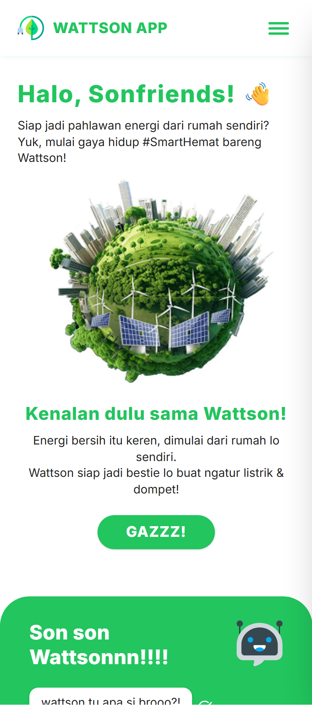
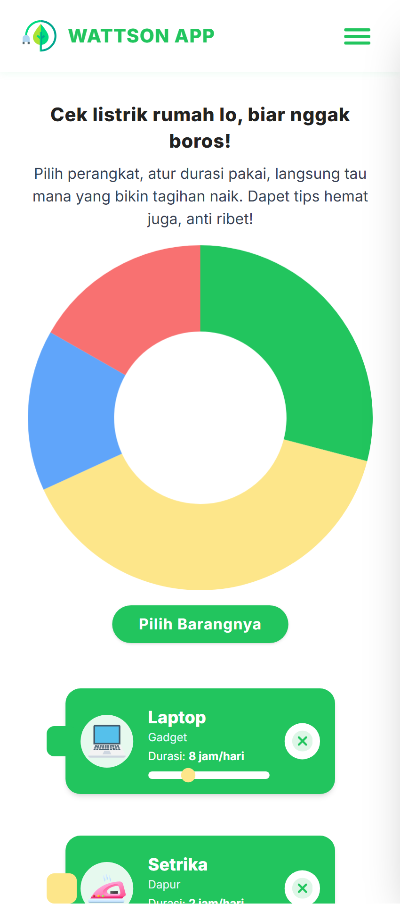
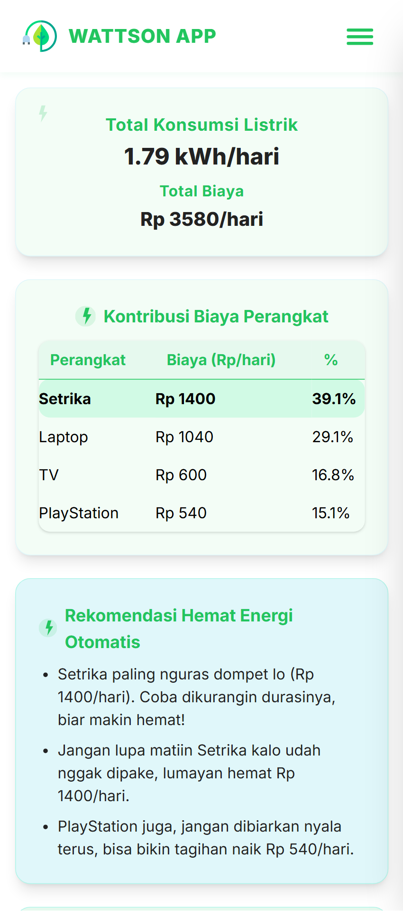

# Wattson App ⚡️

**Capstone Project: Code Generations and Optimization with IBM Granite Student Developer Initiative**

Selamat datang di **Wattson**!  
Aplikasi web yang membantu Anda memahami & mengelola konsumsi listrik rumah secara mudah, visual, dan interaktif.

---

## 🌍 Kaitan dengan SDGs

Wattson mendukung pencapaian **Sustainable Development Goals (SDGs)**, khususnya:

- **SDG 7: Energi Bersih dan Terjangkau**  
  Mendorong efisiensi dan penghematan energi listrik di rumah tangga.
- **SDG 12: Konsumsi dan Produksi yang Bertanggung Jawab**  
  Membantu masyarakat memahami dan mengurangi konsumsi listrik berlebih.
- **SDG 13: Penanganan Perubahan Iklim**  
  Mengurangi emisi karbon melalui penghematan energi di tingkat individu.

Dengan edukasi dan rekomendasi hemat energi, Wattson berkontribusi pada gaya hidup berkelanjutan dan masa depan yang lebih hijau.

---

## 🚀 Demo Online

Coba Wattson langsung di sini:  
👉 [https://wattson-app.vercel.app/](https://wattson-app.vercel.app/)

---

## 📸 Screenshots

Berikut tampilan utama Wattson App:

<div align="center">

<table>
  <tr>
    <td></td>
    <td></td>
    <td></td>
  </tr>
  <tr>
    <td align="center"><b>Beranda</b></td>
    <td align="center"><b>Kalkulator Konsumsi Listrik</b></td>
    <td align="center"><b>Hasil Analisis & Rekomendasi</b></td>
  </tr>
</table>

</div>

---

## 📱 Penting!

**Aplikasi ini adalah mobile web app, dirancang khusus untuk pengalaman terbaik di smartphone Anda!**

---

## 🎯 Latar Belakang & Tujuan Proyek

Di tengah kenaikan biaya hidup, banyak masyarakat kesulitan memahami dampak konsumsi listrik harian terhadap tagihan bulanan. Wattson hadir untuk:

- 🧑‍🏫 **Edukasi Konsumen:** Memahami konsumsi listrik rumah tangga secara praktis dalam bentuk Rupiah (Rp).
- 🤖 **Rekomendasi Cerdas:** Tips hemat energi yang dipersonalisasi berdasarkan data penggunaan perangkat.
- 🌱 **Meningkatkan Kesadaran:** Mendorong aksi nyata penghematan energi, mulai dari stop kontak di rumah Anda.

---

## ✨ Fitur Utama

- 🖼️ **Galeri Perangkat:** Pilih perangkat elektronik umum dari galeri.
- ⏱️ **Input Durasi:** Masukkan durasi pemakaian harian dengan mudah.
- 💸 **Kalkulasi Otomatis:** Lihat konsumsi (kWh) & estimasi biaya (Rp) secara real-time.
- 📊 **Visualisasi Data:** Diagram lingkaran (Pie Chart) interaktif untuk perangkat paling boros.
- 🤖 **Rekomendasi AI:** Tips hemat energi cerdas dari AI (IBM Granite).
- 📱 **UI Modern:** Antarmuka modern, responsif, dan mobile-first.

---

## 🛠️ Teknologi yang Digunakan

| 🚀 Teknologi | 🎯 Fungsi Utama                         |
| ------------ | --------------------------------------- |
| Vite         | Build tool & dev server (cepat, modern) |
| Tailwind CSS | Styling utility-first yang responsif    |
| JavaScript   | Logika inti & interaktivitas            |
| Chart.js     | Visualisasi data interaktif             |
| IBM Granite  | AI untuk generasi kode & tips cerdas    |
| Vercel       | Platform untuk deployment SPA           |

---

## ⚙️ Instalasi & Setup

Ingin mencoba Wattson di lokal? Ikuti langkah berikut:

1. **Clone repository ini:**
   ```sh
   git clone https://github.com/arya/wattson-app.git
   ```
2. **Masuk ke direktori proyek:**
   ```sh
   cd wattson-app
   ```
3. **Install semua dependensi:**
   ```sh
   npm install
   ```
4. **Jalankan development server:**
   ```sh
   npm run dev
   ```
5. **Buka di browser:**  
   [http://localhost:5173](http://localhost:5173)

---

## 🤖 Dukungan AI (IBM Granite)

Wattson memanfaatkan IBM Granite untuk:

- 🗂️ **Generasi Data:** Dataset awal `devices.json` berisi perangkat elektronik umum di Indonesia.
- 🧮 **Generasi Kode:** Fungsi kalkulasi konsumsi & biaya listrik.
- 💡 **Tips Cerdas:** Rekomendasi hemat energi otomatis.

**Contoh Prompt & Hasil:**

- Prompt:  
  `"Generate a JSON array of 25 common household electronic devices in Indonesia, each with name, average wattage, and category."`  
  Hasil: Data perangkat siap pakai dalam format JSON.

- Prompt:  
  `"Generate JavaScript function to calculate daily electricity cost based on watt, hours, and tariff."`  
  Hasil: Fungsi JavaScript untuk kalkulasi utama.

---

## 🤔 Cara Menggunakan Wattson

1. Pilih perangkat elektronik yang Anda gunakan sehari-hari.
2. Atur durasi pemakaian (jam) untuk setiap perangkat.
3. Lihat hasil kalkulasi & visualisasi biaya pada diagram.
4. Ikuti rekomendasi hemat energi dari AI untuk mengurangi tagihan Anda!

---

## 👨‍💻 Developer

Proyek ini dikembangkan oleh:

- **Nama:** Arya Setia Pratama
- **Jurusan:** Teknik Informatika
- **Universitas:** Universitas Lampung

---

Terima kasih telah berkunjung! 🙏  
Yuk, mulai hemat energi dari rumah!
