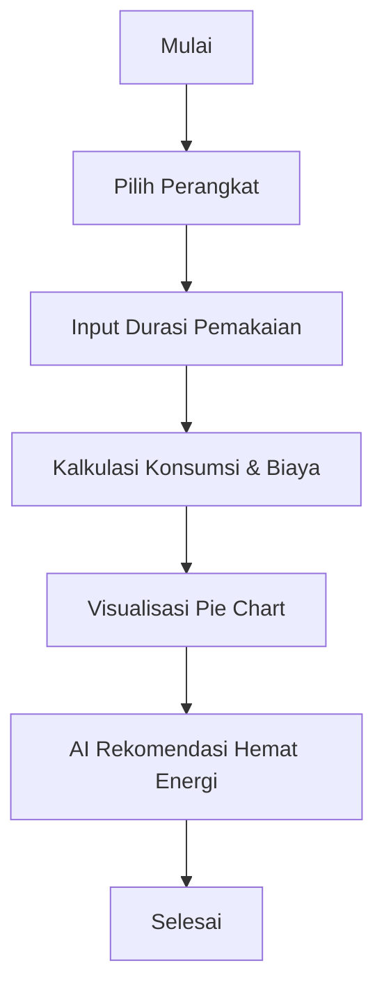

# 🟢 Blueprint Proyek: **Wattson** ⚡️

> **Capstone Project: Code Generations and Optimization with IBM Granite Student Developer Initiative**  
> _Dokumen ini berisi blueprint teknis, strategi, dan penjelasan lengkap untuk pengembangan Wattson App agar memenuhi seluruh grading criteria dan menjadi Top 20 Project._

---

## 1️⃣ Project Overview

### Nama Aplikasi

**Wattson**  
_Gabungan "Watt" + "Son/San" = "Teman Ahli Energimu"._

### Narasi Utama

> _"Aksi Iklim Dimulai dari Stop Kontak di Rumah Anda."_

### Latar Belakang & Permasalahan

Masyarakat, khususnya di kota seperti Pekanbaru, menghadapi kenaikan biaya hidup (termasuk listrik).  
Kesulitan memahami konsumsi listrik harian dalam bentuk nominal (Rp) membuat upaya penghematan kurang efektif.

### Tujuan Proyek

- Membantu masyarakat memahami konsumsi listrik rumah tangga secara praktis dan visual.
- Memberikan rekomendasi hemat energi berbasis data aktual penggunaan perangkat.
- Meningkatkan kesadaran dan aksi nyata penghematan energi.

### Pendekatan & User Flow

1. Pengguna memilih perangkat elektronik yang digunakan di rumah.
2. Input durasi pemakaian harian tiap perangkat.
3. Aplikasi menghitung konsumsi listrik (kWh & biaya).
4. Visualisasi kontribusi tiap perangkat (Chart.js).
5. Rekomendasi hemat energi otomatis (AI/IBM Granite).
6. Pengguna dapat membandingkan dan mengoptimalkan penggunaan.

---

## 2️⃣ Technologies Used

### Teknologi Utama

| Teknologi            | Fungsi Utama              | Alasan Pemilihan                                        |
| -------------------- | ------------------------- | ------------------------------------------------------- |
| **Vite**             | Build tool & dev server   | Cepat, modern, mendukung modul ES, cocok SPA.           |
| **Tailwind CSS**     | Styling & layout          | Utility-first, mobile-first, mudah custom, responsif.   |
| **JavaScript**       | Logic & interaksi         | Bahasa utama web, mudah integrasi dengan tools lain.    |
| **Chart.js**         | Visualisasi data          | Mudah digunakan, interaktif, cocok untuk pie chart.     |
| **IBM Granite**      | AI code generation & tips | Membantu generate data, kode, dan rekomendasi otomatis. |
| **Figma/Excalidraw** | Wireframe & desain UI     | Kolaboratif, mudah digunakan untuk prototyping.         |
| **Netlify/Vercel**   | Deployment                | Mudah, gratis, mendukung SPA dan CI/CD.                 |

### Dokumentasi Setup

- Semua setup dan integrasi dijelaskan di [README.md](./README.md).

---

## 3️⃣ Features

### Fitur Utama

| Fitur                        | Penjelasan Sistematis                                     |
| ---------------------------- | --------------------------------------------------------- |
| **Device Gallery**           | Pilih perangkat elektronik dari daftar (devices.json).    |
| **Input Durasi Pemakaian**   | Slider/input untuk jam penggunaan harian tiap perangkat.  |
| **Kalkulasi Konsumsi**       | Hitung otomatis kWh & biaya (Rp) per perangkat & total.   |
| **Visualisasi Pie Chart**    | Tampilkan kontribusi biaya tiap perangkat (Chart.js).     |
| **Rekomendasi Hemat Energi** | AI (IBM Granite) memberi tips hemat sesuai data pengguna. |
| **Responsive SPA**           | UI modern, mobile-first, interaktif, mudah digunakan.     |

### Cara Kerja Fitur

1. Pengguna memilih perangkat dari gallery.
2. Input durasi pemakaian harian.
3. Kalkulasi otomatis konsumsi listrik dan biaya.
4. Pie chart memperlihatkan perangkat paling boros.
5. AI memberikan rekomendasi hemat energi yang relevan.

---

## 4️⃣ AI Support Explanation (IBM Granite)

### Cara Penggunaan AI

- **Data Generation**: Menggunakan prompt ke IBM Granite untuk menghasilkan daftar perangkat elektronik Indonesia (devices.json).
- **Code Generation**: Membantu generate fungsi kalkulasi konsumsi listrik dan biaya.
- **Smart Tips**: AI menganalisis data input pengguna dan menghasilkan rekomendasi hemat energi otomatis.

### Contoh Prompt & Hasil AI

- **Prompt**:  
  `"Generate a JSON array of 25 common household electronic devices in Indonesia, each with name, average wattage, and category."`
- **Hasil**:
  ```json
  [
    { "name": "Kulkas", "watt": 100, "category": "Dapur" },
    { "name": "AC", "watt": 800, "category": "Pendingin" },
    ...
  ]
  ```
- **Prompt**:  
  `"Generate JavaScript function to calculate daily electricity cost based on watt, hours, and tariff."`
- **Hasil**:
  ```javascript
  function calculateCost(watt, hours, tariff) {
    return ((watt * hours) / 1000) * tariff;
  }
  ```
- **Prompt**:  
  `"Based on user device usage data, generate 3 personalized energy saving tips."`
- **Hasil**:
  - "Kurangi durasi penggunaan AC 1 jam per hari untuk hemat Rp 2400/bulan."
  - "Matikan charger setelah baterai penuh."
  - "Gunakan lampu LED untuk efisiensi energi."

### Dampak Nyata AI

- Mempercepat proses pengembangan data dan kode.
- Memberikan rekomendasi yang relevan dan personal.
- Meningkatkan kualitas dan efisiensi aplikasi.

---

## 5️⃣ Struktur File & Dokumentasi

- **WATTSON.md**: Blueprint teknis, strategi, grading criteria, AI usage.
- **README.md**: Overview, fitur utama, teknologi, setup, AI summary, cara pakai.
- **src/data/devices.json**: Data perangkat elektronik.
- **src/js/**: Logic kalkulasi, UI, integrasi Chart.js.
- **src/css/style.css**: Styling Tailwind.
- **index.html**: Entry point SPA.

---

## 6️⃣ User Flow Diagram



---

## 7️⃣ Checklist Grading Criteria

- [x] Project Overview jelas, latar belakang kuat, masalah relevan.
- [x] Teknologi dijelaskan lengkap, alasan pemilihan sesuai kebutuhan.
- [x] Fitur utama sistematis, cara kerja logis dan sesuai tujuan.
- [x] AI digunakan relevan, penjelasan cara dan dampak nyata.

---

> **Catatan:**  
> Update dokumen ini secara berkala sesuai progress dan feedback reviewer.
